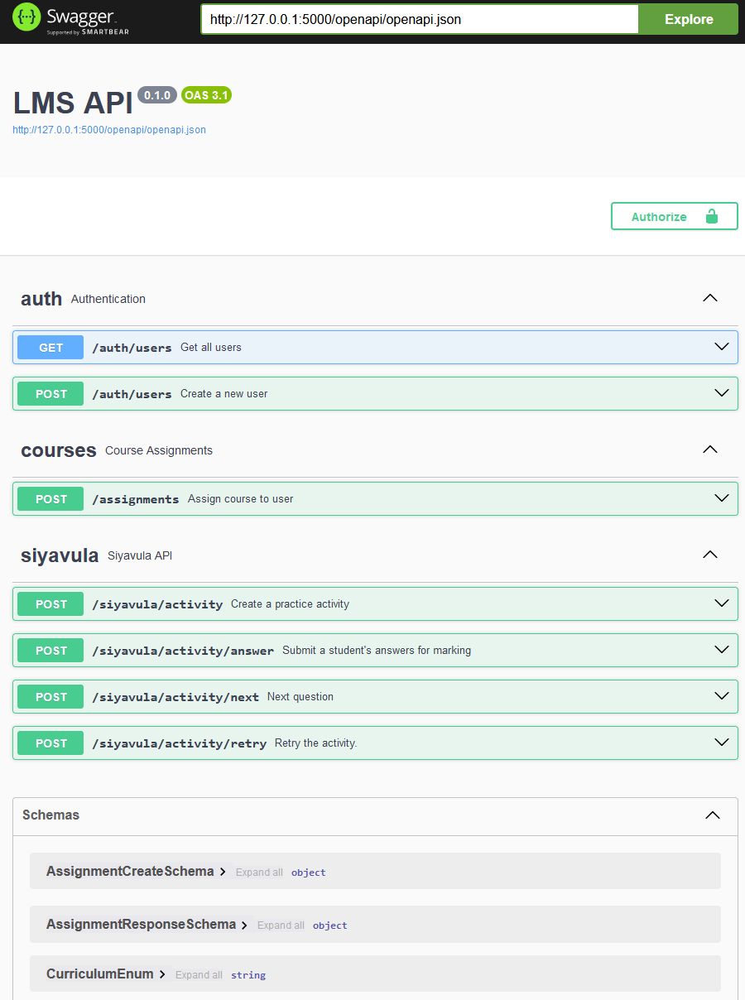

## Ed4All LMS

[](https://github.com/dvdl16/ed4all-lms/actions/workflows/deploy_docs.yml)
[](https://github.com/dvdl16/ed4all-lms/actions/workflows/fly-deploy.yml)
[](https://github.com/dvdl16/ed4all-lms/actions/workflows/python-unittest.yml)

Learning Management System for Ed4All, our online tutoring company

#### License

Dirk van der Laarse

### Features

- User account creation.
- User authentication.
- User course assignment.
- Siyavula API Integration:
  - Client and user token authentication.
  - User account integration with Siyavula accounts.
  - Siyavula activity integration specifically practice:
    - Activity creation
    - Answer submission
    - Next question
    - Retry question


### Project documentation

Project documentation is hosted using Github Pages: [Ed4All LMS Project Documentation](https://ed4all-lms.laarse.co.za/)

### API documentation

When running the application, the OpenAPI Swagger documentation is available at `/openapi`:




### How do I run this

**Using the live Demo version:**

Go to [ed4all-lms.fly.dev](https://ed4all-lms.fly.dev) and have a look. The demo user and password is `demo@siyavula.com`:`demopass`.

*Deployed using [Fly.io](https://fly.io/), running `fly launch` created the files `Dockerfile`, `.dockerignore` and `fly.toml`*

### Using the local Web UI

You would need to install [uv](https://docs.astral.sh/uv/), *the extremely fast Python package and project manager, written in Rust*.

*macOS and Linux:*
```shell
# Step 1: Install uv
curl -LsSf https://astral.sh/uv/install.sh | sh 
# The installation script may be inspected before use with `curl -LsSf https://astral.sh/uv/install.sh | less`

# Step 2: Restart your shell or run `source $HOME/.cargo/env`

# Step 3: Clone the repository
git clone https://github.com/dvdl16/ed4all-lms.git

# Step 4: Run the program, with your sentence/words as arguments
uv run wsgi.py
```

*Windows*
```shell
# Step 1: Install uv
powershell -ExecutionPolicy ByPass -c "irm https://astral.sh/uv/install.ps1 | iex"

# Step 2: Restart your shell

# Step 3: Clone the repository
git clone https://github.com/dvdl16/ed4all-lms.git

# Step 4: Run the program, with your sentence/words as arguments
uv run wsgi.py
```

Open your browser at [http://127.0.0.1:5000/openapi](http://127.0.0.1:5000/openapi)

Remember to set the following Environment variables:
```shell
DEMO_USER_NAME
DEMO_USER_PASS
SIAVULA_API_CLIENT_NAME
SIAVULA_API_CLIENT_PASS
```

### Development

To contribute features and fixes, clone the repository and use `uv`:

**macOS and Linux:**
```shell
# Step 1: Install uv
curl -LsSf https://astral.sh/uv/install.sh | sh 
# The installation script may be inspected before use with `curl -LsSf https://astral.sh/uv/install.sh | less`

# Step 2: Restart your shell or run `source $HOME/.cargo/env`

# Step 3: Clone the repository
git clone https://github.com/dvdl16/scrabblebabble.git

# Step 4: Run uv sync
uv sync
```


#### Tests

We are using an in-memory database for testing. So technically not Unit Tests, but rather Integration Tests. This is still helpful for development.

```shell
uv run python -m unittest discover -s lms_backend/tests
```

#### Contributing

We use [pre-commit](https://pre-commit.com/) for linting. First time setup may be required:
```shell
# Install pre-commit
pip install pre-commit

# Install the git hook scripts
pre-commit install

#(optional) Run against all the files
pre-commit run --all-files
```


The Project documentation has been generated using [mdBook](https://rust-lang.github.io/mdBook/guide/creating.html)

Make sure you have [mdbook](https://rust-lang.github.io/mdBook/guide/installation.html) installed/downloaded. To modify and test locally:
```shell
cd docs
mdbook serve --open
```


### Bugs, ideas, comments, future improvements, wishlist

*Stuff I ran out of time for, or just thought would be good to consider:*

- Option to research: oAuth with Siyavula, call Siyavula API directly from frontend
- Improve scalability by implementing Gunicorn or uWSGI behind an NGINX reverse proxy
- Improve performance by introducing a caching mechanism, like Redis, for:
  - repeated calls to Siyavula API like the TOC `GET`
  - storing of Client and User Tokens
- Add versioning to API (e.g. `/api/v1/users`)
- Make use of Flask-Migrate to handle database schema migrations
- Error handling of non 2xx responses from Siavula API
- Handle expiration of Siyavula Client Token